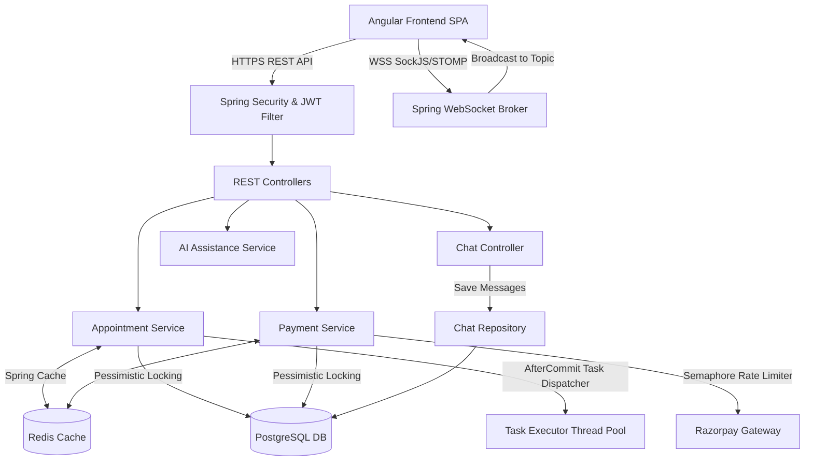

# CareSync - Healthcare Management Platform Backend


CareSync is a high-performance RESTful backend for healthcare orchestration, real-time doctor-patient consultation, tele-vitals tracking, and secure payment processing.

---

## 🏛️ System Architecture



---

## ✨ Key Highlights

- ⚡ **High Concurrency & Locking**: `PESSIMISTIC_WRITE` locks & `Semaphore` rate-limiting prevent double-booking & race conditions.
- 💬 **Real-Time Doctor-Patient Chat**: STOMP over SockJS (`/ws`) with auto-cleanup upon appointment completion.
- 💳 **Secure Payment Processing**: Razorpay gateway integration with idempotent webhook callbacks & duplicate payment guards.
- 🧠 **AI-Powered Diagnostics**: Google Gemini & OpenAI integration for automated medical history summarization and symptom analysis.
- 🚀 **Multi-Tier Caching**: Redis caching with automated fallback to PostgreSQL if Redis is unavailable.
- 🔐 **Field-Level Encryption**: AES encryption (`EncryptionConverter`) for sensitive medical notes and records.

---

## 🛠️ Tech Stack

| Category | Technology |
|---|---|
| **Core Framework** | Spring Boot 3.5, Java 21 |
| **Database** | PostgreSQL 16 (JPA / Hibernate) |
| **Caching** | Redis (Lettuce Client) |
| **Real-Time Communication** | Spring WebSocket, STOMP, SockJS |
| **Security** | Spring Security 6, JWT, AES Encryption |
| **Integrations** | Razorpay SDK, Google Gemini / OpenAI |
| **Documentation** | OpenAPI / Swagger UI |

---

## 📖 Documentation & Links

- 📐 **[System Architecture Deep-Dive](docs/architecture_overview.md)**
- 🧪 **[Java Concurrency Learning Lab](docs/java-concurrency-learning-lab.md)**
- 🗄️ **[Database ERD Diagram](https://dbdiagram.io/d/6970e7c2bd82f5fce22c9b1d)**
- 🌐 **[Live Swagger API UI](http://caresync-backend-aq8e.onrender.com/swagger-ui)**

---

## ⚡ Quick Start

```bash
# Clone the repository
git clone https://github.com/vikrant48/careSync.git
cd careSync

# Run backend locally
./mvnw spring-boot:run
```
