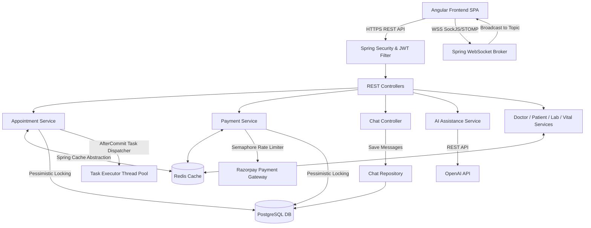
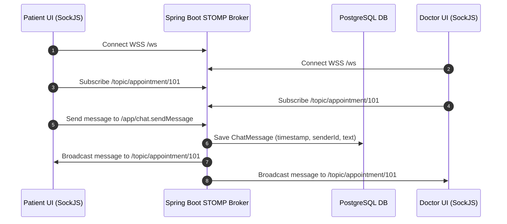
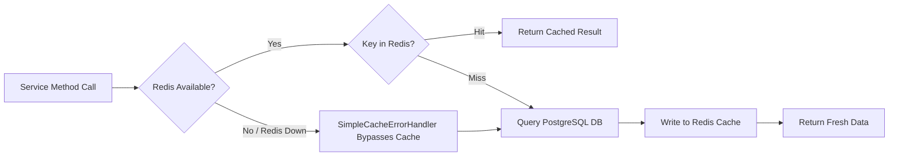
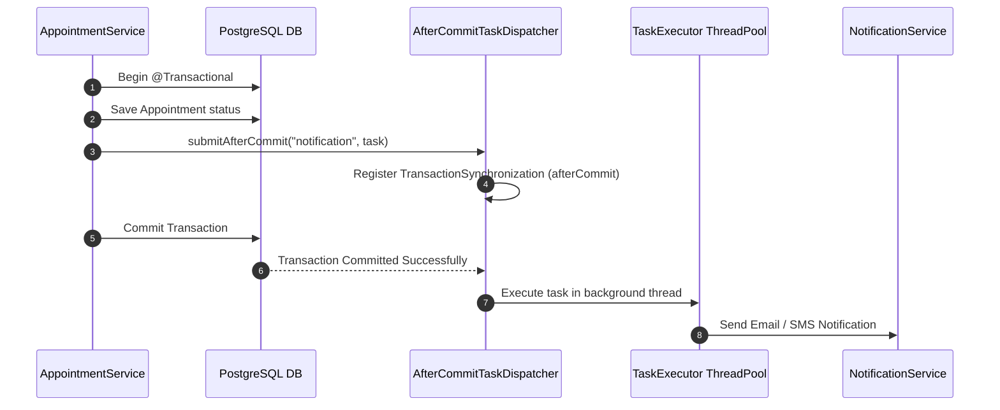

# CareSync System Architecture & Technical Deep-Dive

CareSync is an enterprise-grade Healthcare Management Platform designed for high-concurrency appointment scheduling, real-time doctor-patient communication, telemetry/vitals tracking, AI-assisted health recommendations, and secure payment processing.

---

## 1. High-Level System Architecture

---

## 2. Layer-by-Layer Architectural Breakdown

### A. Frontend Layer (Angular SPA)
- **Framework**: Angular 17+ (TypeScript, RxJS, Reactive Forms).
- **Core Modules**:
  - **Auth & Security**: JWT interceptor attached to outgoing HTTP requests, route guards for `ROLE_PATIENT`, `ROLE_DOCTOR`, and `ROLE_ADMIN`.
  - **Dashboard Feeds**: Real-time patient & doctor appointment management, vitals history graphs, and financial summary cards.
  - **WebSocket Chat Module**: Connects via SockJS/STOMP to `/ws`, subscribes to `/topic/appointment/{appointmentId}` for real-time doctor-patient consultation chat.

---

### B. Backend API & Business Logic (Spring Boot 3.x)

#### 1. Security & Data Protection Layer
- **Stateless JWT Security**: Requests authenticated via `JwtAuthenticationFilter`, verifying bearer tokens in header.
- **Field-Level Encryption**: Sensitive patient data (SSN, medical notes) uses JPA `@Convert(converter = EncryptionConverter.class)` leveraging AES encryption before persisting to PostgreSQL.

#### 2. Service Layer & Deeper Logic
- **`AppointmentService`**:
  - **Conflict Validation**: Checks doctor leave schedule (`DoctorLeaveService`) and computes slot overlap using optimized DB count query `countConflictingAppointments(...)`.
  - **Transactional Consistency**: Uses `@Transactional` and offloads post-commit side effects (e.g. notifications) via `AfterCommitTaskDispatcher`.
- **`PaymentService`**:
  - **Idempotency & Duplicate Guards**: Validates `hasActivePaymentForBooking(...)` to prevent multiple pending/successful payments per booking.
  - **Semaphore Throttling**: Controls concurrency to payment gateway APIs using `Semaphore paymentGatewaySemaphore = new Semaphore(10, true)`.
  - **Callback Handling**: Locks payment entity via `findByPaymentGatewayTransactionIdForUpdate(...)` (`PESSIMISTIC_WRITE`) to safely handle asynchronous Razorpay webhooks.

---

### C. Real-Time Chat Architecture (`WebSocket` + `STOMP`)

- **Endpoint**: `/ws` (with SockJS fallback enabled for restricted networks).
- **Message Router**:
  - Destinations starting with `/app` routed to `@MessageMapping` handlers.
  - Message broker handles subscriptions to `/topic` and `/queue`.
- **Chat Retention & Auto-Cleanup**: Chat history saved per `appointmentId`. When appointment status changes to `COMPLETED`, `chatRepository.deleteByAppointmentId(saved.getId())` clears history to comply with privacy policies.

---

### D. Multi-Tier Database & Data Access Layer

- **Database**: PostgreSQL (Supabase Cloud / Local instance).
- **JPA & Hibernate ORM**: Managed via Spring Data JPA repositories.
- **Entities**: `User`, `Patient`, `Doctor`, `Appointment`, `Booking`, `Payment`, `ChatMessage`, `Vital`, `DoctorLeave`, `Feedback`, `LabTest`.

#### Deep Logic: Concurrency & Lock Modes

| Entity / Resource | Concurrency Mechanism | Purpose |
| --- | --- | --- |
| **`Appointment`** | `@Lock(LockModeType.PESSIMISTIC_WRITE)` (`findByIdForUpdate`) | Prevents double-booking during concurrent patient booking/reschedule requests. |
| **`Doctor`** | `@Lock(LockModeType.PESSIMISTIC_WRITE)` (`findByIdForUpdate`) | Serializes slot allocation for high-demand doctors. |
| **`Booking`** | `@Lock(LockModeType.PESSIMISTIC_WRITE)` (`findByIdForUpdate`) | Guarantees atomic status updates (PENDING to COMPLETED). |
| **`Payment`** | `@Lock(LockModeType.PESSIMISTIC_WRITE)` (`findByPaymentGatewayTransactionIdForUpdate`) | Avoids race conditions on webhook retries or concurrent payment callbacks. |
| **Payment Gateway** | `Semaphore(10, true)` | Limits outgoing API calls to 10 concurrent requests with fair queueing. |
| **Scheduled Tasks** | `AtomicBoolean cleanupRunning` (`compareAndSet`) | Ensures cron tasks (e.g. midnight stale appointment deactivation) execute only once across worker threads. |

---

### E. Caching Architecture (Redis with Fallback)

- **Manager**: `RedisCacheManager` configured in `CacheConfig.java`.
- **Serialization**: `GenericJackson2JsonRedisSerializer` with Jackson JavaTime & Jdk8 modules.
- **TTL Hierarchy**:
  - `PATIENT:*` (Profiles, Appointments, Vitals, Financials): **5 Minutes TTL**.
  - `DOCTOR:*` (Profiles, Certificates, Education, Experience): **1 Hour TTL**.
  - `ANALYTICS:*` (System Overviews, Rating aggregates): **15 Minutes TTL**.
- **Fault-Tolerant Cache Error Handler**: Implements custom `CacheErrorHandler`. If Redis goes down or drops connection, queries automatically fall back directly to PostgreSQL without throwing runtime errors to the client.

---

### F. Asynchronous Task Dispatcher (`AfterCommitTaskDispatcher`)

- **Problem Solved**: Triggering emails/notifications inside `@Transactional` can cause phantom notifications if the transaction rolls back later.
- **Solution**: `AfterCommitTaskDispatcher` checks `TransactionSynchronizationManager.isSynchronizationActive()` and queues tasks to `TaskExecutor` **only after** DB commit succeeds.

---

## 3. External Service Integrations

1. **Razorpay Payment Gateway (`RazorpayService`)**:
   - Order creation (`createOrder`), payment URLs generation (UPI, QR Code, Card), and webhook HMAC-SHA256 signature verification (`verifySignature`).
2. **AI Health Assistant (`AiService`)**:
   - Analyzes patient symptoms and vitals to provide intelligent appointment suggestions and automated preliminary health guidance.

---

## 4. Key Request Execution Lifecycles

### Complete Lifecycle: Booking an Appointment
1. **Request Received**: Patient submits `doctorId`, `appointmentDateTime`, `reason`.
2. **Locking**: `DoctorRepository.findByIdForUpdate(doctorId)` locks doctor row via `PESSIMISTIC_WRITE`.
3. **Validation**: Checks `doctor.canAcceptAppointments()`, `patient.canBookAppointment()`, and `doctorLeaveService.isDoctorOnLeave(...)`.
4. **Slot Conflict Check**: Runs DB count query `countConflictingAppointments(...)` within a +/- 1 hour window.
5. **Persistence**: Saves new `Appointment` entity in `BOOKED` status.
6. **Post-Commit Dispatch**: `AfterCommitTaskDispatcher` registers post-commit hook; upon successful DB commit, background thread sends notification to doctor.
7. **Cache Eviction**: `@CacheEvict` invalidates patient & doctor appointment cache keys in Redis.
