# Java Concurrency and Multithreading Learning Lab

This guide is tied to runnable examples in:

`src/test/java/com/vikrant/careSync/concurrency/ConcurrencyLearningTest.java`

Run the full lab:

```bash
./mvnw -Dtest=ConcurrencyLearningTest test
```

Make sure `java -version` reports Java 21 or newer before running the lab. If your terminal still points to an older JDK after installing a newer one, update `JAVA_HOME` first.

Run one topic at a time:

```bash
./mvnw -Dtest=ConcurrencyLearningTest#blockingQueueConnectsProducerAndConsumer test
```

## 1. Core vocabulary

| Term | Meaning | CareSync example |
| --- | --- | --- |
| Concurrency | Multiple tasks are in progress during the same time window. | Many patients booking appointments at once. |
| Parallelism | Multiple tasks literally run at the same instant on different CPU cores. | Analytics calculations split across cores. |
| Thread | A path of execution inside one Java process. | One request handled by one server worker thread. |
| Shared state | Data touched by more than one thread. | Appointment slot availability, cache values, payment status. |
| Race condition | Correctness depends on unlucky thread timing. | Two bookings both see the same slot as available. |
| Critical section | Code that must not be executed by multiple threads at once. | Reserve slot, update payment, change appointment status. |
| Visibility | One thread's write is seen by another thread. | A background reminder task sees a cancellation flag. |
| Atomicity | A compound operation happens as one indivisible step. | Incrementing a counter without losing updates. |

## 2. Java thread lifecycle

Example: `threadLifecycleJoinMakesWorkDeterministic`

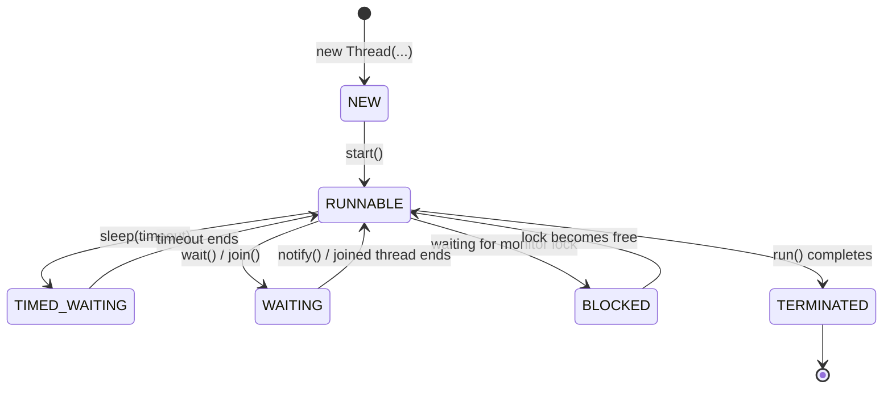

Important idea: `start()` creates a new call stack. Calling `run()` directly does not create a new thread.

```java
Thread worker = new Thread(task);
worker.start(); // concurrent
worker.join();  // current thread waits until worker finishes
```

## 3. Race condition: why `counter++` is not safe

Example: `raceConditionDropsUpdateButAtomicIntegerDoesNot`

`counter++` looks like one operation, but it is really three steps.

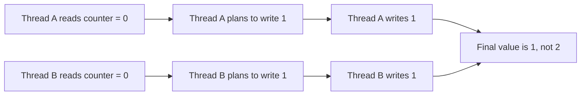

Fix options:

```java
AtomicInteger counter = new AtomicInteger();
counter.incrementAndGet();
```

```java
synchronized void increment() {
    value++;
}
```

Use `AtomicInteger` for simple counters. Use `synchronized` or locks when multiple fields must change together.

## 4. `synchronized`

Example: `synchronizedProtectsSharedState`

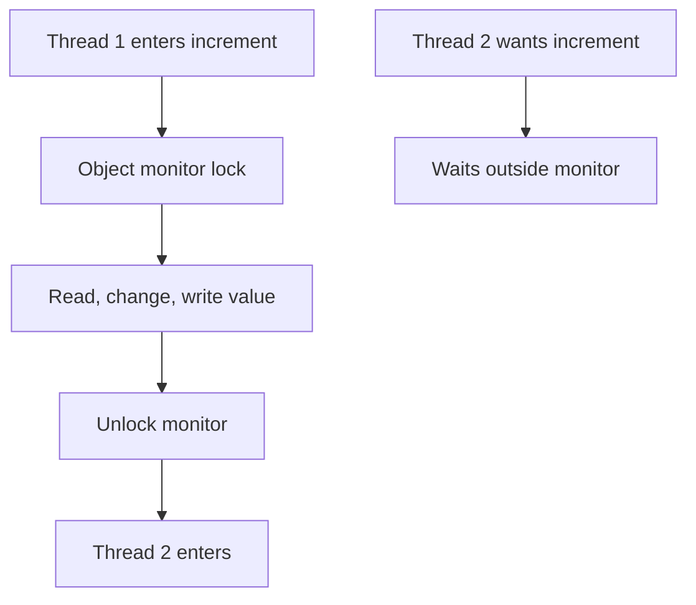

Rules:

| Rule | Why it matters |
| --- | --- |
| Guard every access to the same shared data with the same lock. | Mixed locking still causes races. |
| Keep synchronized blocks small. | Long locks reduce throughput. |
| Never call slow external services while holding a lock. | Other threads wait unnecessarily. |

## 5. `ReentrantLock` and `tryLock`

Example: `reentrantLockCanAvoidWaitingForeverForABusySlot`

`synchronized` waits until the lock is available. `ReentrantLock` can try, timeout, and fail gracefully.

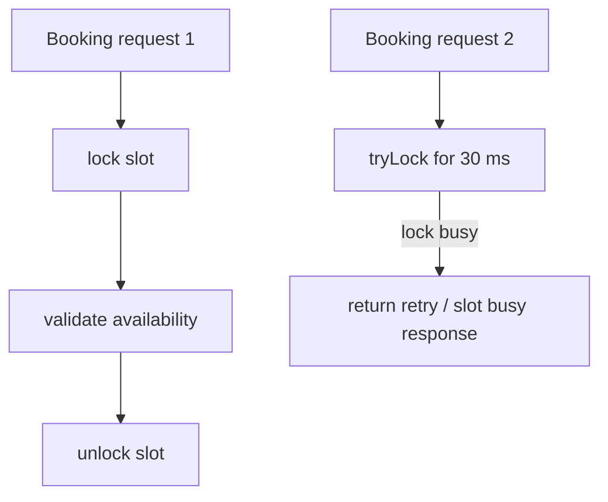

This pattern fits appointment booking because the second request should not wait forever.

## 6. `Semaphore` for throttling

Example: `semaphoreLimitsParallelExternalCalls`

Use a semaphore when only N tasks may enter a section at once.

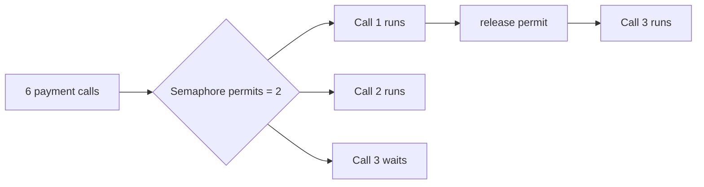

Good uses:

| Use | Permit count example |
| --- | --- |
| External payment gateway limit | 2-10 calls |
| File upload processing | CPU or bandwidth based |
| AI provider calls | Provider rate limit based |

## 7. Producer-consumer with `BlockingQueue`

Example: `blockingQueueConnectsProducerAndConsumer`

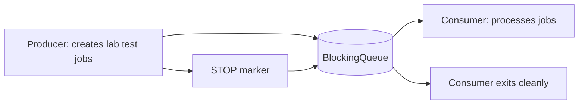

Why it is useful:

| Problem | Queue behavior |
| --- | --- |
| Producer is faster than consumer. | Queue buffers work. |
| Queue is full. | Producer blocks instead of losing data. |
| Queue is empty. | Consumer blocks instead of busy-waiting. |

Prefer `BlockingQueue` over manual `wait()` and `notify()` for most producer-consumer code.

## 8. `CompletableFuture` for async pipelines

Example: `completableFutureCombinesIndependentAsyncWork`

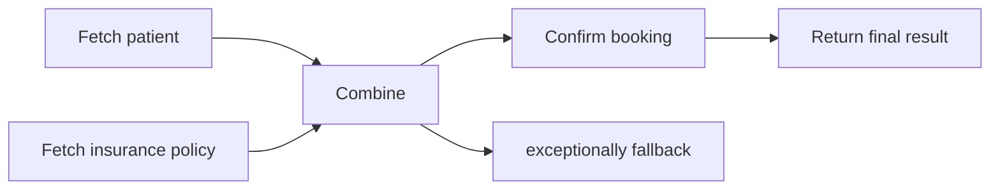

Common methods:

| Method | Use |
| --- | --- |
| `supplyAsync` | Start async work that returns a value. |
| `runAsync` | Start async work that returns nothing. |
| `thenApply` | Transform a result. |
| `thenCompose` | Start another async step from a result. |
| `thenCombine` | Merge two independent async results. |
| `exceptionally` | Recover from failure. |

## 9. `ScheduledExecutorService`

Example: `scheduledExecutorRunsReminderLater`

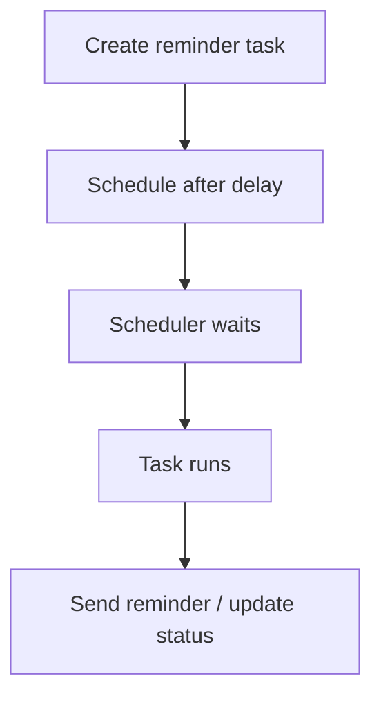

CareSync already has scheduled behavior in `AppointmentDeactivationTask`. Use this idea for reminders, payment timeout cleanup, and periodic maintenance.

## 10. `ReadWriteLock`

Example: `readWriteLockAllowsManyReadersAndBlocksWriter`

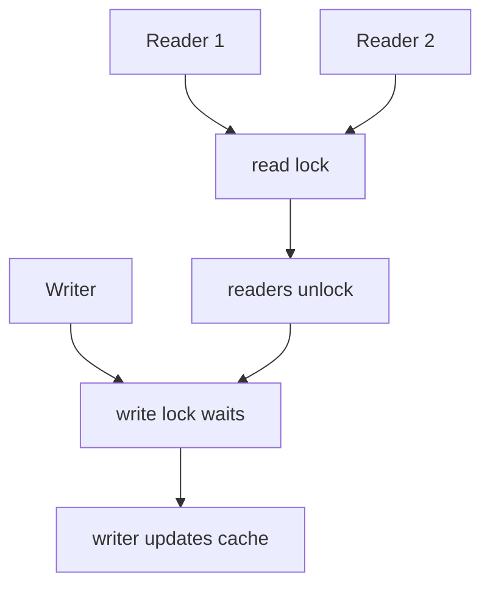

Use it when reads are frequent and writes are rare, such as master data cache reads.

## 11. `ThreadLocal`

Example: `threadLocalKeepsRequestDataSeparatePerThread`

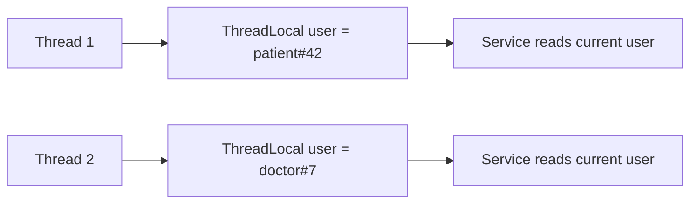

Spring Security uses a related idea for request-specific security context.

Always call `remove()` when using your own `ThreadLocal` in pooled threads. Thread pools reuse threads, so old values can leak into later work.

## 12. Deadlock and lock ordering

Example: `consistentLockOrderingAvoidsDeadlock`

Deadlock happens when threads wait on each other forever.

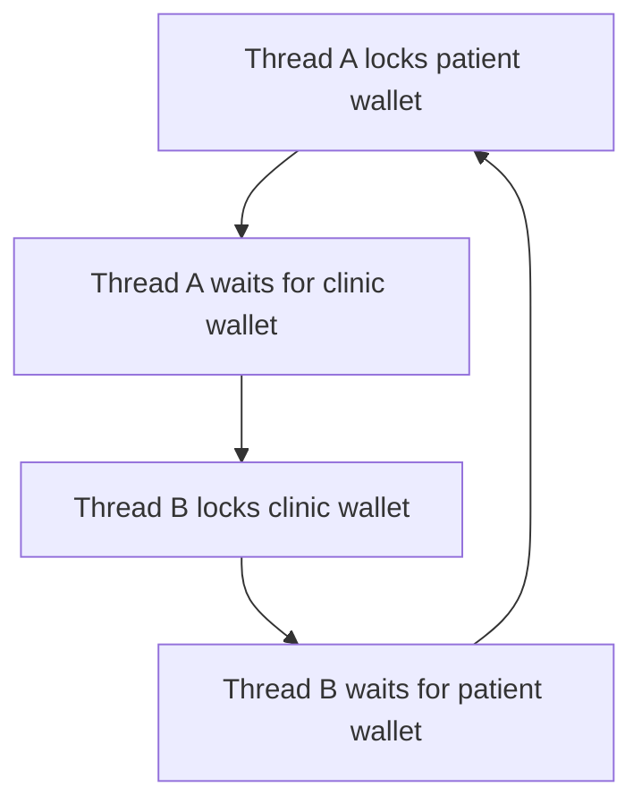

One fix is consistent lock ordering.

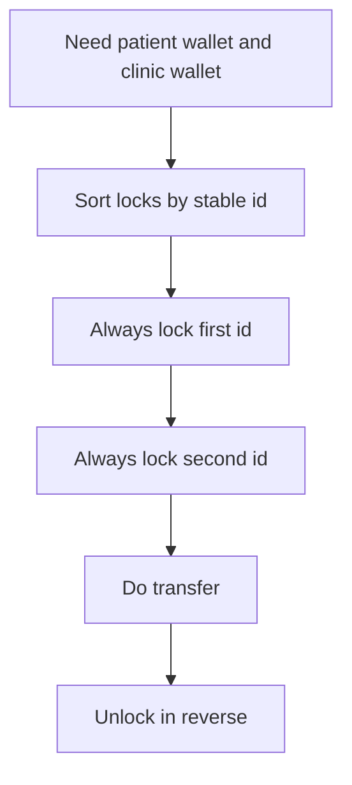

## 13. Virtual threads in Java 21

Example: `virtualThreadsHandleManyWaitingTasksInJava21`

Virtual threads are lightweight threads managed by the JVM. They are excellent for blocking I/O style work, such as waiting for database, HTTP, file, or email operations.


Use virtual threads for high-concurrency blocking work. Do not expect them to make CPU-heavy work faster; CPU-heavy work still needs available CPU cores.

## 14. `volatile`

`volatile` solves visibility, not compound atomicity.

Good use:

```java
class ShutdownSignal {
    private volatile boolean stopRequested;

    void requestStop() {
        stopRequested = true;
    }

    boolean shouldStop() {
        return stopRequested;
    }
}
```

Bad use:

```java
volatile int counter;
counter++; // still not atomic
```

Use `AtomicInteger`, `LongAdder`, `synchronized`, or a lock for counters.

## 15. Concurrent collections

Use the collections from `java.util.concurrent` instead of wrapping normal collections yourself.

| Collection | Use |
| --- | --- |
| `ConcurrentHashMap` | Shared lookup/update map. |
| `CopyOnWriteArrayList` | Many reads, rare writes, small lists. |
| `BlockingQueue` | Producer-consumer work handoff. |
| `ConcurrentLinkedQueue` | Non-blocking queue. |
| `LongAdder` | High-contention counters and metrics. |

## 16. How concurrency appears in Spring Boot and CareSync

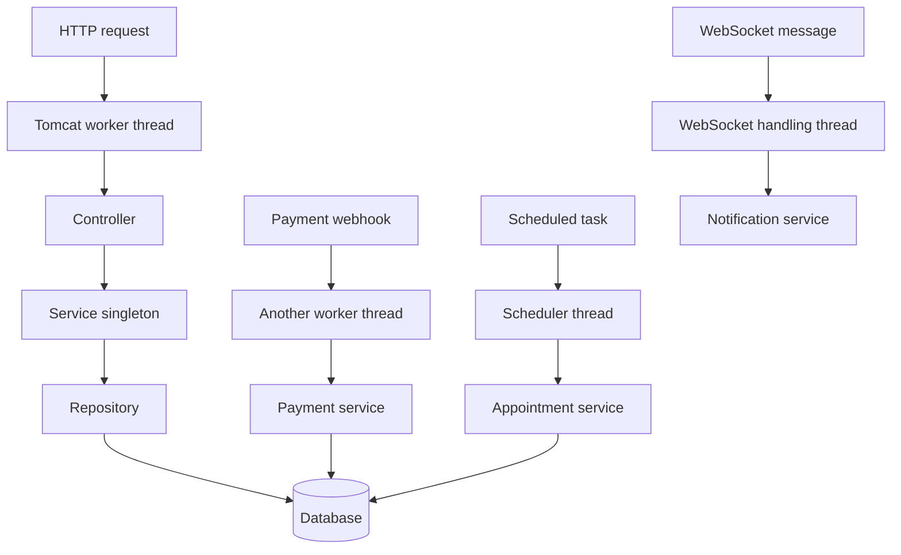

Key rules for this project:

| Rule | Why |
| --- | --- |
| Keep controllers and services stateless when possible. | Spring services are singletons by default. Shared fields are shared by all requests. |
| Use database transactions for real booking/payment consistency. | JVM locks do not protect data across multiple app instances. |
| Prefer optimistic/pessimistic DB locking for appointment slots. | Two servers can otherwise book the same slot. |
| Use queues/futures for slow side effects. | Email, AI calls, and notifications should not block critical paths unnecessarily. |
| Use timeouts around external calls. | Threads should not wait forever on payment, storage, or AI providers. |
| Do not hold locks while calling external systems. | It creates slow critical sections and can cascade delays. |

## 17. What to learn in order

1. Thread lifecycle: `Thread`, `Runnable`, `start`, `join`, `sleep`.
2. Shared state bugs: race conditions, visibility, atomicity.
3. Basic safety: `synchronized`, `AtomicInteger`, `volatile`.
4. Coordination: `CountDownLatch`, `CyclicBarrier`, `BlockingQueue`.
5. Executors: `ExecutorService`, fixed pools, scheduled pools.
6. Advanced locks: `ReentrantLock`, `ReadWriteLock`, `Semaphore`.
7. Async composition: `CompletableFuture`.
8. Spring-specific concurrency: request threads, singleton services, transactions, scheduled tasks.
9. Java 21 virtual threads.
10. Production design: idempotency, database locking, retries, timeouts, backpressure.

## 18. Quick decision guide

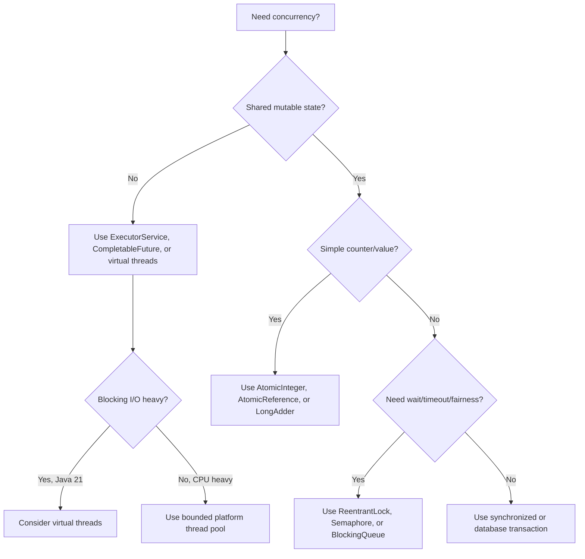
